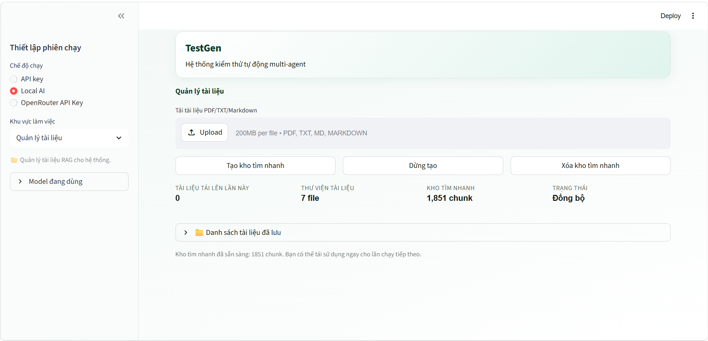
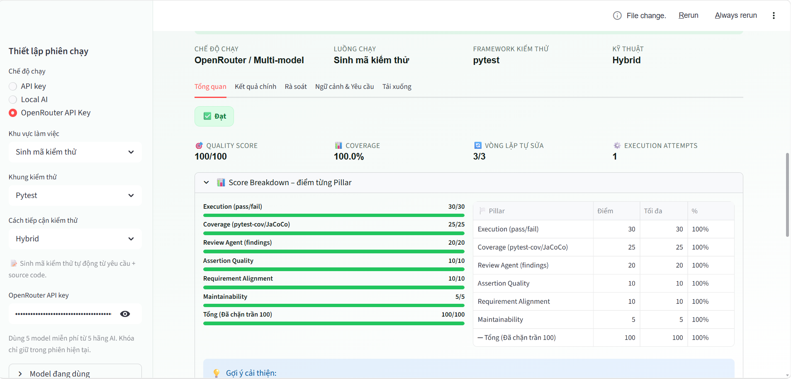
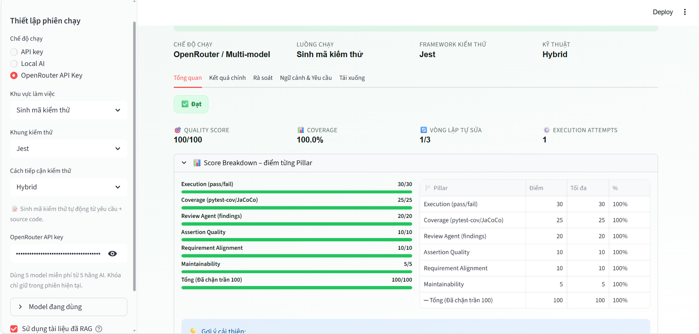
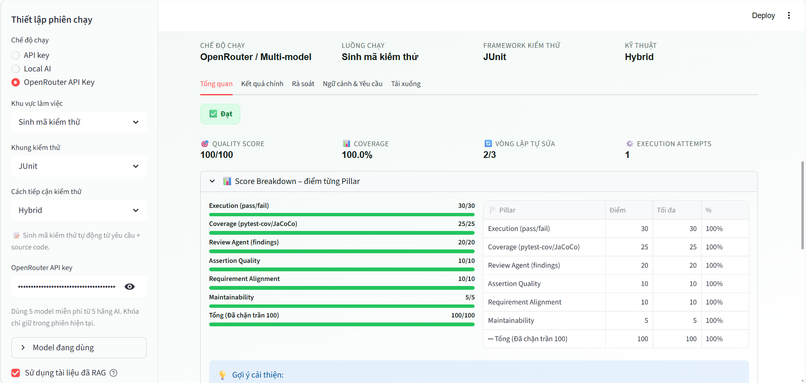
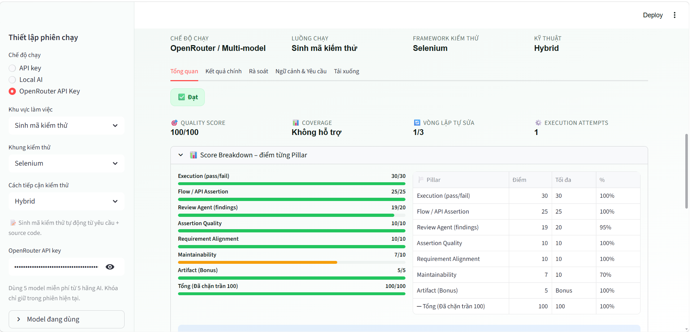
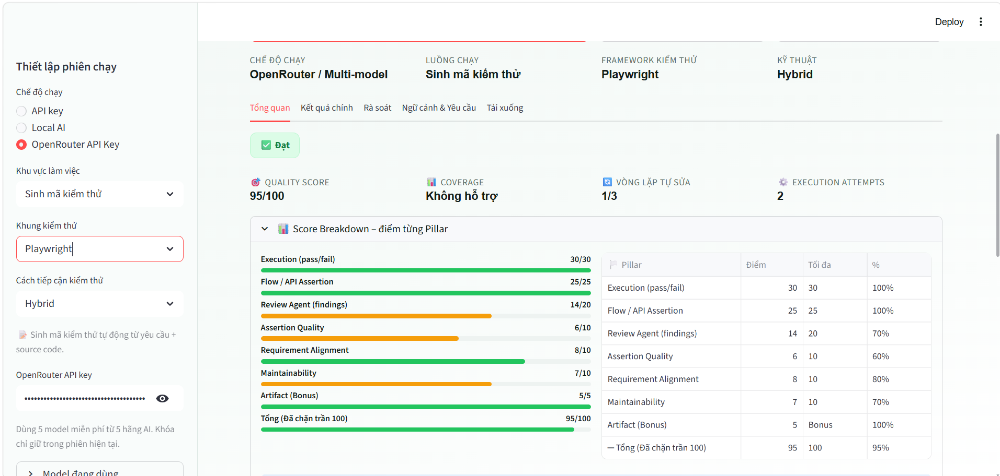
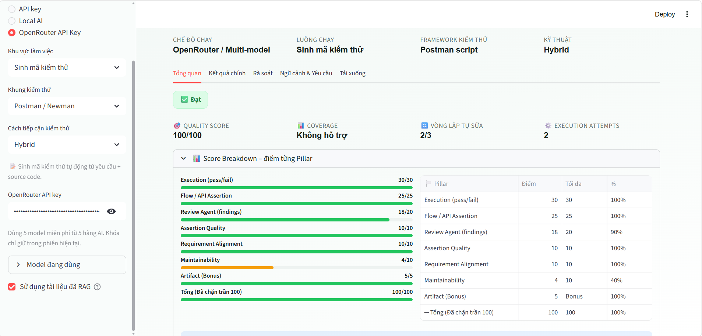
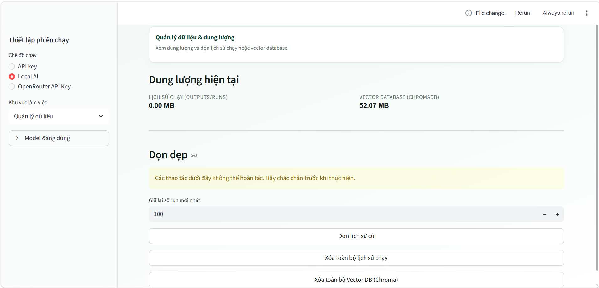

# TestGen - Hệ thống kiểm thử tự động Multi-Agent

Ứng dụng Streamlit đa tác tử (multi-agent) hỗ trợ sinh, chạy và rà soát mã kiểm thử từ yêu cầu nghiệp vụ, tài liệu RAG, mã nguồn ứng dụng và tệp kiểm thử đầu vào.



## 📌 Các tính năng chính
- **Sinh mã kiểm thử tự động**: Tự động phân tích cây cú pháp AST, sinh test plan và sinh test code tối ưu cho 6 framework khác nhau.
- **Tự động sửa lỗi (Self-Healing)**: Khi chạy thử gặp lỗi, hệ thống tự động đọc log lỗi của trình thực thi và sửa mã nguồn test.
- **Rà soát mã nguồn kiểm thử (Code Review)**: Phân tích chất lượng test code có sẵn và xuất báo cáo điểm số chi tiết.
- **Quản lý tài liệu RAG**: Chunk và index tài liệu nghiệp vụ vào ChromaDB để tăng độ chính xác khi sinh test case.

---

## ⚙️ Luồng hoạt động chính của hệ thống (Pipeline Flow)

Quy trình xử lý đa tác tử (multi-agent) tự động khép kín của TestGen khi bạn nhấn nút **Sinh mã kiểm thử**:

1. **Nạp & Phân tích dữ liệu**: Hệ thống tải tài liệu nghiệp vụ (RAG) và phân tích cây cú pháp trừu tượng (AST) của mã nguồn đầu vào.
2. **Requirement Agent**: Trích xuất chi tiết các yêu cầu nghiệp vụ dưới dạng cấu trúc JSON chuẩn hóa.
3. **Test Planning Agent**: Thiết lập kế hoạch kiểm thử (Test Plan) chi tiết, định nghĩa các ca kiểm thử cần viết và tự động sửa định dạng nếu LLM sinh lỗi.
4. **Function Prompt Builder**: Dựng prompt động dựa trên cấu trúc hàm, lớp, các nhánh điều kiện (branches) và exception bắt gặp từ AST.
5. **Code Generator Agent**: Kêu gọi mô hình ngôn ngữ lớn (LLM) để sinh mã test tương ứng với khung kiểm thử đã chọn.
6. **Thực thi kiểm thử (Run Executor)**: Khởi chạy bộ test suite vừa sinh trong môi trường hộp cát (sandbox) cô lập để kiểm tra tính đúng đắn và đo lường độ phủ mã nguồn (coverage).
7. **Tự động sửa lỗi & Retry (Self-Healing)**: 
   - Nếu chạy thử gặp lỗi cú pháp hoặc logic, hệ thống gửi log lỗi ngược lại AI để sửa đổi mã nguồn test.
   - Nếu test thành công nhưng chưa đạt độ phủ dòng code mong muốn, hệ thống sẽ thực hiện thử lại (retry) tập trung vào các nhánh dòng code bị thiếu.
8. **Code Review Agent**: Chạy phân tích tĩnh chất lượng mã test nguồn và đánh giá điểm số chất lượng tổng quan.
9. **Xuất báo cáo (Formatter)**: Lưu trữ mã nguồn test hoàn chỉnh, kết quả chạy và xuất các tệp báo cáo chi tiết (Excel, PDF, độ phủ HTML) vào thư mục `outputs/runs/`.

---

## ⚙️ Cài đặt & Chuẩn bị môi trường

### 1. Cài đặt Python & Trình quản lý thư viện
Yêu cầu Python 3.10+ (Khuyến nghị dùng Conda/Miniconda).
Cài đặt toàn bộ thư viện cần thiết (bao gồm cả các thư viện chạy demo local và E2E) bằng lệnh:
```bash
pip install -r requirements.txt
```

### 2. Cài đặt môi trường chạy Test (Node.js & Java)
Để TestGen có thể biên dịch, chạy và đo lường độ phủ của các bộ test không phải Python trong môi trường hộp cát (sandbox):

- **Node.js & NPM (Yêu cầu cho framework Jest)**:
  - Yêu cầu Node.js phiên bản LTS mới nhất (v18+). Tải và cài đặt tại: [https://nodejs.org/](https://nodejs.org/)
  - Xác nhận đã cài đặt bằng lệnh: `node -v` và `npm -v` trong terminal.
- **Java JDK & Apache Maven (Yêu cầu cho framework JUnit 5)**:
  - Yêu cầu Java JDK 17+ và Apache Maven.
  - Khuyến nghị tải JDK tại: [https://adoptium.net/](https://adoptium.net/) (Eclipse Temurin) và Maven tại [https://maven.apache.org/](https://maven.apache.org/)
  - Cấu hình biến môi trường `JAVA_HOME` và thêm thư mục `bin` của Maven vào biến `PATH`.
  - Xác nhận đã cài đặt bằng lệnh: `java -version` và `mvn -version`.

### 3. Thiết lập Biến môi trường
Sao chép cấu hình từ file mẫu để tạo file `.env` (tệp này đã được cấu hình trong `.gitignore` để tránh lộ khóa):
```bash
# Trên Windows cmd / powershell
copy .env.example .env
```
Mở file `.env` và điền các API key của bạn (`GEMINI_API_KEY` hoặc `OPENROUTER_API_KEY`) nếu chạy chế độ Cloud AI.

> [!TIP]
> **Cách lấy OpenRouter API Key**:
> Bạn có thể tạo và lấy API Key tại: [https://openrouter.ai/workspaces/default/keys](https://openrouter.ai/workspaces/default/keys)

> [!IMPORTANT]
> **Lưu ý về Bảo mật**:
> Bạn cũng có thể nhập trực tiếp Gemini API Key hoặc OpenRouter API Key ngay trên giao diện web (khung Sidebar bên trái). API Key nhập trên giao diện chỉ lưu tạm thời trong bộ nhớ phiên chạy (Session State) của trình duyệt và sẽ tự động xóa sạch khi kết thúc phiên làm việc, đảm bảo an toàn bảo mật.

### 4. Tải các mô hình AI Local (Ollama)

- **Lựa chọn A: Nếu chạy chế độ Local AI (Ollama)**, hãy khởi động Ollama và chạy các lệnh tải toàn bộ mô hình sau:
  ```bash
  ollama pull qwen2.5:7b
  ollama pull llama3.1:8b
  ollama pull qwen2.5-coder:7b
  ollama pull deepseek-coder:6.7b
  ollama pull nomic-embed-text
  ```

- **Lựa chọn B: Nếu chỉ sử dụng OpenRouter API**, bạn không cần tải các mô hình sinh mã cồng kềnh trên máy. Tuy nhiên, hệ thống vẫn cần mô hình cục bộ để thực hiện nhúng (embed) tài liệu phục vụ tính năng RAG. Bạn chỉ cần tải duy nhất mô hình sau:
  ```bash
  ollama pull nomic-embed-text
  ```

### 5. Chạy ứng dụng Streamlit

Để khởi chạy ứng dụng không bị lỗi hiển thị tiếng Việt (Unicode) trên Windows Terminal, bạn có hai cách:

#### Lựa chọn 1: Chạy bằng file script đóng gói sẵn (Khuyến nghị trên Windows / VS Code Terminal)
Chạy lệnh sau trên cửa sổ Terminal của VS Code (sử dụng PowerShell) để tự động cấu hình mã hóa UTF-8 toàn hệ thống và khởi chạy ứng dụng:
```powershell
.\run_utf8.ps1
```

#### Lựa chọn 2: Khởi chạy thủ công bằng lệnh Streamlit
*Mẹo khắc phục lỗi Unicode hiển thị tiếng Việt trên Windows Terminal:*
- Nếu dùng **PowerShell** (Terminal mặc định trong VS Code):
  ```powershell
  $env:PYTHONIOENCODING="utf-8"
  streamlit run app.py
  ```
- Nếu dùng **Command Prompt (cmd)**:
  ```cmd
  set PYTHONIOENCODING=utf-8
  streamlit run app.py
  ```

---

## 🚀 Hướng dẫn chạy thử nghiệm với các tệp Demo cụ thể

Dưới đây là hướng dẫn chạy demo chi tiết cho từng framework sử dụng các tệp mẫu nằm trong thư mục `examples/demo/`.

### 1. Pytest (Python Unit Test)

- **Tệp nguồn (Source code dưới test)**: [examples/demo/pytest/order_processor.py](examples/demo/pytest/order_processor.py)
- **Cách chạy**:
  1. Trong sidebar, chọn Khung kiểm thử: **Pytest**.
  2. Tại bảng **Sinh mã kiểm thử**, tải lên file [order_processor.py](examples/demo/pytest/order_processor.py) làm nguồn.
  3. Nhấn **Sinh mã kiểm thử**. Hệ thống sẽ tự động tạo bộ test suite hoàn chỉnh, đo độ phủ (coverage) và tự sửa lỗi nếu có.

### 2. Jest (JavaScript Unit Test)

- **Tệp nguồn**: [examples/demo/jest/library_manager.js](examples/demo/jest/library_manager.js)
- **Cách chạy**:
  1. Chọn Khung kiểm thử: **Jest**.
  2. Tải lên file [library_manager.js](examples/demo/jest/library_manager.js).
  3. Nhấn **Sinh mã kiểm thử**. Trình thực thi sẽ gọi `npx jest` để chạy các file test sinh ra và thu thập dữ liệu độ phủ dòng code.

### 3. JUnit 5 (Java Unit Test)

- **Tệp nguồn**: [examples/demo/junit/LibraryManager.java](examples/demo/junit/LibraryManager.java)
- **Cách chạy**:
  1. Chọn Khung kiểm thử: **JUnit**.
  2. Tải lên file [LibraryManager.java](examples/demo/junit/LibraryManager.java).
  3. Nhấn **Sinh mã kiểm thử**. TestGen sẽ tạo cấu trúc Maven ảo độc lập và biên dịch, thực thi kiểm thử bằng `mvn test`.

### 4. Selenium (Python Web E2E)

- **Tệp giao diện (HTML Page)**: [examples/demo/selenium/shopping_cart.html](examples/demo/selenium/shopping_cart.html)
- **Cách chạy**:
  1. Chọn Khung kiểm thử: **Selenium**.
  2. Tải lên file [shopping_cart.html](examples/demo/selenium/shopping_cart.html).
  3. Nhấn **Sinh mã kiểm thử**. AI sẽ phân tích cấu trúc DOM và sinh mã python sử dụng thư viện Selenium webdriver để tự động click chọn, điền form giỏ hàng và kiểm thử luồng UI.

### 5. Playwright (Python Web E2E)

- **Tệp giao diện (HTML Page)**: [examples/demo/playwright/shopping_cart.html](examples/demo/playwright/shopping_cart.html)
- **Cách chạy**:
  1. Chọn Khung kiểm thử: **Playwright**.
  2. Tải lên file [shopping_cart.html](examples/demo/playwright/shopping_cart.html).
  3. Nhấn **Sinh mã kiểm thử** để AI sinh mã kiểm thử E2E tối ưu bằng Playwright Python API.

### 6. Postman / Newman (API Integration Test)


#### Lựa chọn A: Demo qua API thật từ xa (Khuyến nghị - Nhanh nhất)
- **Tệp Collection (Không chứa test)**: [examples/demo/postman/remote_api/typicode_crud.postman_collection.json](examples/demo/postman/remote_api/typicode_crud.postman_collection.json)
- **Cách chạy**:
  1. Chọn Khung kiểm thử: **Postman / Newman**.
  2. Tải lên tệp [typicode_crud.postman_collection.json](examples/demo/postman/remote_api/typicode_crud.postman_collection.json).
  3. Nhấn **Sinh mã kiểm thử**. Newman sẽ tự động sinh test và gửi request thật đến endpoint hoạt động `https://jsonplaceholder.typicode.com` để kiểm định.

#### Lựa chọn B: Demo qua API Server cục bộ (Local)
- **Tệp API Server**: [examples/demo/postman/local_api_server/inventory_api.py](examples/demo/postman/local_api_server/inventory_api.py)
- **Tệp Collection**: [examples/demo/postman/local_api_server/local_inventory.postman_collection.json](examples/demo/postman/local_api_server/local_inventory.postman_collection.json)
- **Cách chạy**:
  1. Bật API Server cục bộ ở Terminal:
     ```bash
     python examples/demo/postman/local_api_server/inventory_api.py
     ```
     Server sẽ hoạt động tại địa chỉ: `http://127.0.0.1:8000`.
  2. Trên giao diện TestGen, chọn khung **Postman / Newman** và tải lên file [local_inventory.postman_collection.json](examples/demo/postman/local_api_server/local_inventory.postman_collection.json).
  3. Nhấn **Sinh mã kiểm thử** để thực hiện gửi request đến local server và đo đạc kết quả.

---

## 📊 Quản lý Dữ liệu & RAG

Bạn có thể truy cập khu vực làm việc **Quản lý dữ liệu** hoặc **Quản lý tài liệu** để dọn dẹp các tệp tạm, xem kích thước lưu trữ của cơ sở dữ liệu Vector (ChromaDB) hoặc làm sạch lịch sử chạy của TestGen nhằm tối ưu bộ nhớ ổ đĩa.
